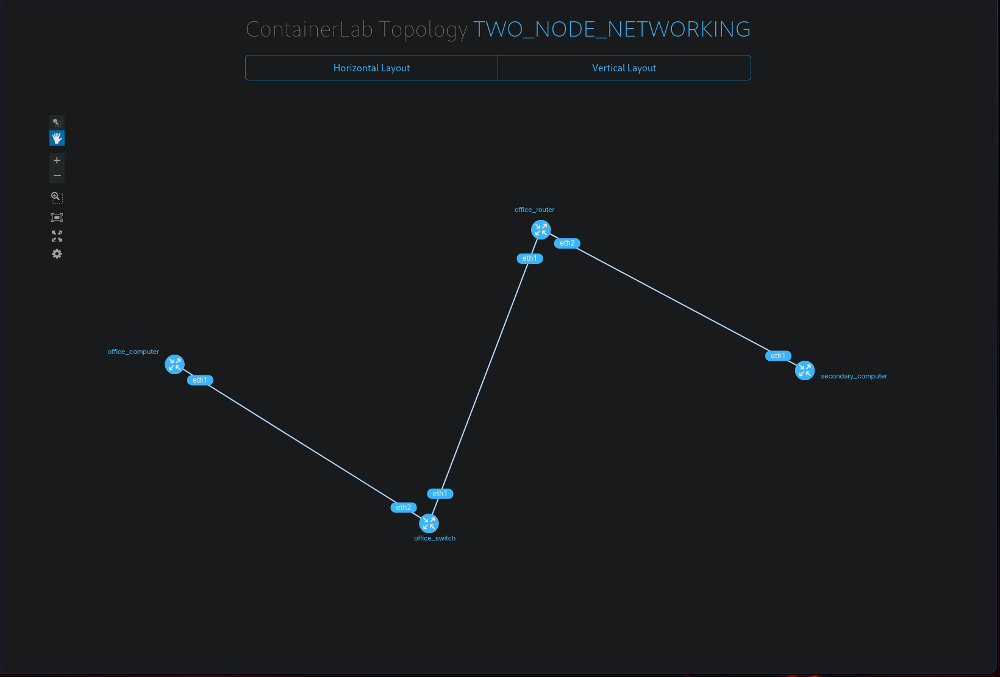
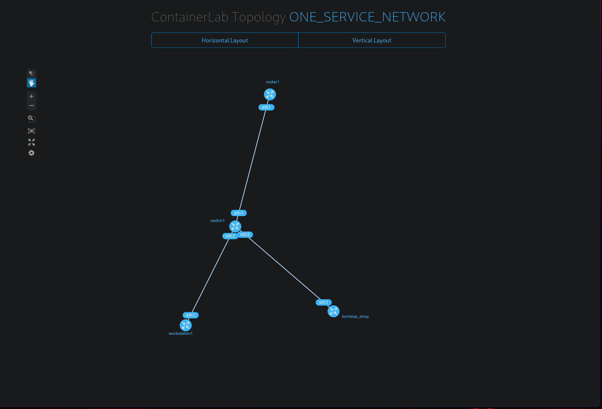

# networking-sm3ai3

## Things I learnt overall
```
As per style guide:
    - Use snake case for yaml files
```

## Journal 1: Two node network
__Reflection__  
I created a network involving two workstations connected to a router, with one
connected to a switch


For the router, I used the frrouting/frr image from dockerhub and teacher given
scripts for the switch setup. Small alpine containers provided a clean slate to 
build everything from the gorund up. The main problem faced was assigning static
IP Addresses to each of the workstations since I wanted to use as little shell
files as possible. To overcome this, I utilized shell arguments which looked
like the following:
```bash
IP=$1

ip addr add 192.168.1.$1/24 dev eth1
```
There was also a brief moment where machines could ping eachother even though
they weren't connected directly via endpoint connections. This was quickly
understood however though since machines were simply connected via their own 
docker network. I circumvented this by reordering their network priorities. Most
of the components of this task I already knew how to do, so I used other methods
of creating such as the already mentioned shell scripting

## Journal 2: One service network
__Installation and Usage__
```bash
username@localhost~$ sudo containerlab deploy -t one_service_network/one_service_network.yaml
username@localhost~$ sudo docker exec -it clab-one_service_network_workstation1 bash
/# sudo -u clabcustomer ssh terminal.shop # ssh into terminal.shop as user 'shopcustomer'
```

__Reflection__  
This topology reflects a coffee shop that can be accessed terminal cli. Users
will be dropped into the workstation environment where they can use secure shell
to remote into the coffee shop interface. To do this I created a simple network
which included a router, switch and two alpine workstations, again recreating
their network interface to avoid the default docker network. There were many
problems faced here since it was my first time creating something like this. The
first issue faced was getting around ssh authentication. To avoid inseurities in
authenticationless login, I opted for creating ssh key pairs to create a
passwordless system. I quickly found out that it was significantly easier to 
create secondary users for both systems since root ssh-keys were also insecure.
Next I had automatically initialize the shop interface upon login. Originally I
had wanted to use the ~/.bashrc file but quickly found that because of how small
Alpine Linux is, it didn't come with one even when installing bash. To
circumvent this, I used the /etc/profiles file to create a global instance of
the python scripts. Speeking of python scripts, I originally wanted this system
to be as small as possible so I had originally opted for C. However again,
because of how small Alpine linux was by default, there were runtime issues
where the program would hang randomly in deployment. I decided to just recreate
it in python though it was refreshing to program in C again. There were also a 
few small 'issues' that were quickly fixed such as skipping the ssh hash
verification as well as tidying up small things. However, most of these issues
were subverted with the ~/.ssh/config file. This was also how I created the
alias, terminal.shop.



Through this part of the assessment, I further deepened my understanding on both
the quirkyness of linux systems as well as a brush up on different languages. I
was so close to doing it in java for the kick of it. In hindsight, if I were to
do this project a second time, I would find a way to kick the user out of the
ssh session as soon as the shop program is shut or suspended manually using
^C or ^Z. I would also make the terminal command more elegant whether it be 
completely disabling passworded logins or creating keys for root.

## Journal 3: Load balancer and two service nodes network
__Installation and Usage__
```bash
username@localhost~$ sudo containerlab deploy -t load_balancer_and_two_service_nodes_network.yaml
username@localhost~$ curl http://{local ip}:8000/ # Replace local ip with your own private ip address. localhost dns name is hit or miss
```

__Reflection__  
This topology recreates a simple load balancer network. Inspiration was taken
from teacher's resources but modified as I saw fit to be more resource
conservative. In the backend, when a user connects to their local port 8000,
containerlab binds that to port 80 for the load balancers docker container.
HAProxy (load balancing software) then takes the request and forwards it to one
of the nginx powered webservers. Modern load balancers will have a record of 
each servers system load, but assumes all requests will be even. As a result, it
forwards requests to servers in a round robin fashion, meaning that each server
will take turns in handling requests.


This network is an example of horizontal
scaling where the only way to effectively balance requests, is to add more
machines. In the making of this container, I opted to modify most of the given
files such as the file layout to use the shell arguments as said before. I also
used my own networking init scripts to change the primary network to frrouting
as opposed to its own docker network counterpart.
